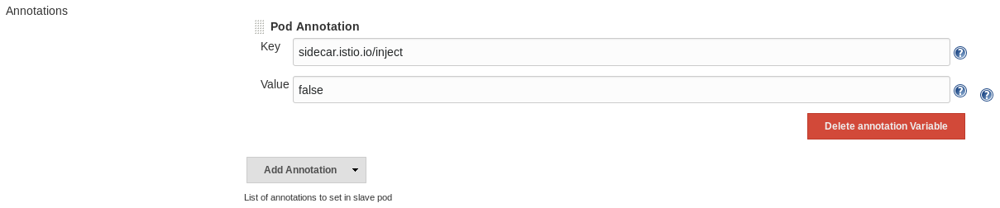

# Canary Deployment with Jenkins and Istio

## Steps

1. [Prerequisites](#1-prerequisites)
2. [Sample Application](#2-sample-application)
3. [Create the Pipeline](#3-create-the-pipeline)
4. [Deploy Canary Branch](#4-deploy-canary-branch)
5. [Deploy Master](#5-deploy-master)

### 1. Prerequisites

1. A Kubernetes cluster with Istio installed
2. Jenkins installed on that cluster
3. A git repository


#### Configuring Jenkins

Automatic sidecar injection needs to be disabled for the Jenkins worker pods.
Under "Manage Jenkins" > "Configure System" > "Cloud" > "Kubernetes Pod Template"
add a new Pod Annotation with a key of `sidecar.istio.io/inject` and a value of
`false`.




Three additional containers need to be configured in the "Kubernetes Pod
Template" section of the Jenkins configuration.

1. A Python pod using the image python:3-alpine. This pod is used to install
   the application for running tests and building the image in a subsequent
   step.
2. A Docker pod using the image docker. This pod is used to build the image and
   push it to the IBM Container Registry.
3. A kubectl pod using the image lachlanevenson/k8s-kubectl. This pod is used to
   deploy the application to Kubernetes.

### 2. Sample Application
The sample application uses Flask and just returns its version.

```python
from flask import Flask

version = b"0.1.0"
app = Flask(__name__)

@app.route("/")
def hello():
    return version

if __name__ == '__main__':
    app.run(host='0.0.0.0', port=8080, debug=True)
```

Create a simple test in `tests/test_version.py` that can be run in the 'test'
step of the pipeline.

```python
import pytest
import app

@pytest.fixture
def client():
    client = app.app.test_client()
    yield client


def test_version(client):
    req = client.get('/')
    assert req.data == app.version
```

#### Create the deployment manifests

Create a new directory named `deployment` and create `app.yaml` inside it.

```yaml
kind: Deployment
  metadata:
name: sampleapp
spec:
  replicas: 1
  template:
    metadata:
      labels:
        app: sampleapp
    spec:
      containers:
      - name: sampleapp
        image: registry.ng.bluemix.net/<namespace>/sampleapp:v1
        imagePullPolicy: Always
---
apiVersion: v1
kind: Service
metadata:
  name: samplepp
spec:
  type: LoadBalancer
  ports:
  - port: 8080
    name: http
  selector:
    app: sampleapp
```

The canary deployment is the same as the one in app.yaml except the name is
different and no service needs to be defined.

```yaml
kind: Deployment
  metadata:
name: sampleapp-canary
spec:
  replicas: 1
  template:
    metadata:
      labels:
        app: sampleapp
    spec:
      containers:
      - name: sampleapp
        image: registry.ng.bluemix.net/<namespace>/sampleapp:canary
        imagePullPolicy: Always
```

#### Deploy the sample application

```bash
$ kubectl apply -f deployment/app.yaml
```
This creates a Service and a Deployment. To access the application find the
load balancer IP.

```bash
$ HOST=$(kubectl get svc sampleapp -o jsonpath="{.status.loadBalancer.ingress[0].ip}")
$ curl http://$HOST
0.1.0
$
```

Commit the code.

```bash
$ git add app.py deployment/
$ git commit -m "v1"
$ git push origin master
```

### 3. Create the Pipeline
Create a Multibranch Pipeline. In "Branch Sources" add a new Git source and add
the link to your sample application repository. Under "Scan Multibranch
Pipeline Triggers" check the box which says "Periodically if not otherwise run"
and set the interval to 1 minute.

By default this will look for the pipeline definition in a Jenkinsfile in the
root of the project.

```groovy
def gitSHA

pipeline {
  agent {
    kubernetes {
      defaultContainer 'jnlp'
    }
  }

  stages {
    stage('Checkout') {
      steps {
        checkout scm
        script {
          gitSHA = sh(returnStdout: true, script: 'git rev-parse --short HEAD')
        }
      }
    }
    stage('Install') {
      steps {
        container('python') {
          sh 'pip install -r requirements.txt'
        }
      }
    }
    stage('Test') {
      steps {
        container('python') {
          sh 'pytest'
        }
      }
    }
    stage('Build') {
      environment {
        TAG = "$gitSHA"
      }
      steps {
        container('docker') {
          sh 'docker login -u token -p ${REGISTRY_TOKEN} registry.ng.bluemix.net'
          sh 'docker build -t $IMAGE_REPO/demoapp:$TAG .'
          sh 'docker push $IMAGE_REPO/demoapp:$TAG'
        }
      }
    }
    stage('Deploy Canary') {
      when { branch 'canary' }
      steps {
        container('kubectl') {
          sh 'apk update && apk add gettext'
          sh "export TAG=$gitSHA" + 'envsubst < deployment/canary.yaml | kubectl apply -f -'
        }
      }
    }
    stage('Deploy Production') {
      when { branch 'master' }
      steps {
        container('kubectl') {
          sh 'apk update && apk add gettext'
          sh "export TAG=$gitSHA" + 'envsubst < deployment/app.yaml | kubectl apply -f -'
        }
      }
    }
  }
}

```

### 4. Deploy Canary Branch

Create the canary branch.
```bash
$ git checkout -b canary
```

Change the version in app.py to 0.2.0.

```python
app.version = b"0.2.0"
```

Commit the changes and push the branch.

```bash
$ git add app.py
$ git commit -m "Version 0.2.0"
$ git push origin canary
```
The pipeline will now run and create a new Kubernetes deployment named canary.

```bash
$ kubectl get svc
NAME             DESIRED   CURRENT   UP-TO-DATE   AVAILABLE   AGE
demoapp          1         1         1            1           1h
demoapp-canary   1         1         1            1           1h
```

Because both deployments have the same `app:` label the Service will load
balance requests across the master and canary deployments. This does work
without Istio but it's much less flexible.

For example, if you wanted to send 2% of all traffic to the canary deployment
you would need to have a minimum of 50 replicas running. Because Istio

#### 5. Deploy Master

```bash
$ git push master origin
```
